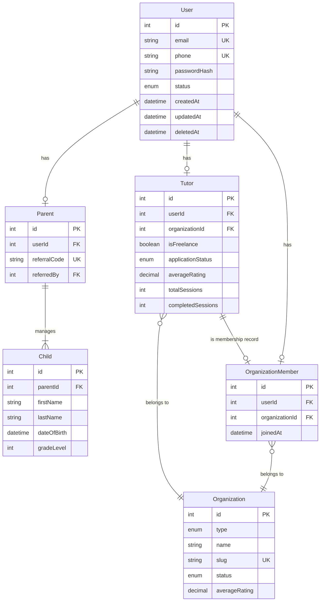
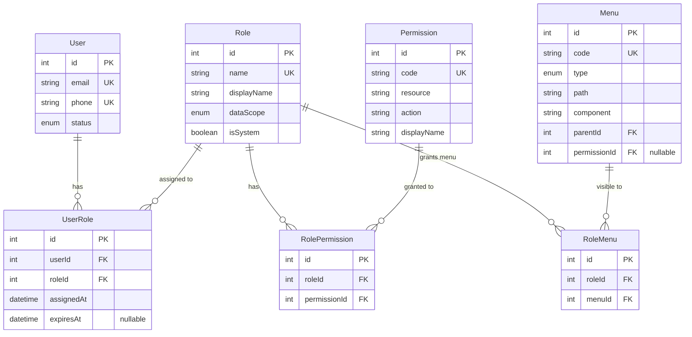

# Hệ Thống Quản Lý Người Dùng & Phân Quyền - Kiggle Platform

## 📋 Tổng Quan

Document này trình bày về hệ thống quản lý người dùng và phân quyền của **Kiggle Platform** - một marketplace kết nối phụ huynh với các dịch vụ giáo dục (khóa học, gia sư tại nhà).

---

## 🎯 Bài Toán Quản Lý Của Kiggle

### Kiggle là gì?

**Kiggle** là một **platform/marketplace** đóng vai trò trung gian, kết nối:

| Bên Cung Cấp | Bên Sử Dụng |
|--------------|-------------|
| **Organizations** (Trung tâm giáo dục, đối tác) | **Parents** (Phụ huynh) |
| **Tutors** (Gia sư cá nhân hoặc thuộc tổ chức) | Tìm khóa học cho con |

### Mô Hình Kinh Doanh

```
┌─────────────────────────────────────────────────────────┐
│                    KIGGLE PLATFORM                       │
│              (Marketplace/Platform Owner)                 │
└─────────────────────────────────────────────────────────┘
                          │
        ┌─────────────────┼─────────────────┐
        │                 │                 │
        ▼                 ▼                 ▼
┌──────────────┐   ┌──────────────┐   ┌──────────────┐
│ ORGANIZATION │   │ ORGANIZATION │   │ ORGANIZATION │
│  (Partner)   │   │  (Freelance) │   │  (Partner)   │
│              │   │              │   │              │
│ ┌──────────┐ │   │ ┌──────────┐ │   │ ┌──────────┐ │
│ │  Tutor   │ │   │ │  Tutor   │ │   │ │  Tutor   │ │
│ │  Tutor   │ │   │ │          │ │   │ │  Tutor   │ │
│ └──────────┘ │   │ └──────────┘ │   │ └──────────┘ │
└──────────────┘   └──────────────┘   └──────────────┘
        │                 │                 │
        └─────────────────┼─────────────────┘
                          │
                          ▼
                  ┌──────────────┐
                  │    PARENT    │
                  │  (Customer)  │
                  └──────────────┘
```

---

## 👥 Các Đối Tượng Trong Hệ Thống

### 1. **Kiggle** (Platform Owner)

**Vai trò:**
- Quản lý toàn bộ platform
- Quản lý tất cả organizations, tutors, parents
- Xem được tất cả dữ liệu (doanh thu, bookings, reviews)
- Cấu hình hệ thống (roles, permissions, menus)

**Đặc điểm:**
- Có quyền truy cập **GLOBAL** (toàn bộ dữ liệu)
- Không thuộc về bất kỳ organization nào
- Quản lý các đối tác và người dùng

---

### 2. **Organization** (Tổ Chức)

**Hai loại Organization:**

#### a) **Partner Organization** (Đối Tác)
- **Ví dụ:** Trung tâm Anh ngữ ABC, Trung tâm Toán học XYZ
- **Đặc điểm:**
  - Tổ chức độc lập, có giấy phép kinh doanh
  - Tự quản lý nhân viên (admin, staff)
  - Tự quản lý tutors thuộc tổ chức
  - Tự quản lý products (khóa học, dịch vụ)
  - Chỉ thấy dữ liệu của chính mình

#### b) **Freelance Organization** (Tổ Chức Tự Tạo Cho Gia Sư Tự Do)
- **Ví dụ:** Gia sư Nguyễn Văn A tự tạo "Nhóm Gia Sư Nguyễn Văn A"
- **Đặc điểm:**
  - Tự động tạo khi tutor freelance đăng ký
  - Tutor đó là admin của organization này
  - Có thể mời thêm tutors khác vào (tương lai)
  - Quản lý products và bookings của chính mình
  - Chỉ thấy dữ liệu của chính mình

**Quyền Quản Lý:**
- ✅ Tự quản lý organization (thông tin, địa chỉ, logo)
- ✅ Tự quản lý tutors thuộc organization
- ✅ Tự quản lý products (khóa học, dịch vụ)
- ✅ Tự quản lý bookings từ parents
- ✅ Xem reports và analytics của chính mình
- ❌ Không thể xem dữ liệu của organizations khác
- ❌ Không thể quản lý parents (chỉ Kiggle mới có quyền này)

---

### 3. **Tutor** (Gia Sư)

**Hai loại Tutor:**

#### a) **Tutor Thuộc Partner Organization**
- **Ví dụ:** Gia sư làm việc cho Trung tâm Anh ngữ ABC
- **Đặc điểm:**
  - Thuộc về một Partner Organization cụ thể
  - Được organization quản lý
  - Chỉ thấy bookings/products của organization đó
  - Không thể tạo organization mới

#### b) **Freelance Tutor** (Gia Sư Tự Do)
- **Ví dụ:** Gia sư độc lập, không thuộc tổ chức nào
- **Đặc điểm:**
  - Tự động có một Freelance Organization
  - Là admin của organization đó
  - Tự quản lý products và bookings của chính mình
  - Có thể mời tutors khác vào (tương lai)

**Quyền:**
- ✅ Xem và quản lý bookings của mình
- ✅ Chat với parents
- ✅ Xem lịch học
- ✅ Cập nhật profile
- ❌ Không thể xem dữ liệu của tutors khác (trừ khi cùng organization)

---

### 4. **Parent** (Phụ Huynh)

**Vai trò:**
- **End User / Customer** của marketplace
- Tìm kiếm và đăng ký khóa học cho con
- Đặt lịch học với tutors/organizations
- Thanh toán và đánh giá dịch vụ

**Đặc điểm:**
- Không thuộc về organization nào
- Có thể xem **TẤT CẢ** products trên marketplace (không bị giới hạn bởi organization)
- Chỉ thấy bookings của chính mình
- Chỉ quản lý thông tin của chính mình và con cái

**Quyền:**
- ✅ Xem tất cả products (marketplace view)
- ✅ Đặt booking với bất kỳ tutor/organization nào
- ✅ Chat với tutors/organizations
- ✅ Xem lịch học của con
- ✅ Thanh toán và đánh giá
- ✅ Quản lý thông tin cá nhân và con cái
- ❌ Không thể quản lý tutors/organizations
- ❌ Không thể xem bookings của parents khác

---

## 🔐 Hệ Thống Phân Quyền (Authorization System)

Hệ thống phân quyền của Kiggle sử dụng **2 lớp bảo vệ**:

### 1. **RBAC** (Role-Based Access Control) - "Người dùng CÓ THỂ làm gì?"

**Câu hỏi:** "User này có quyền thực hiện hành động này không?"

**Ví dụ:**
- ✅ `PARTNER_ADMIN` có quyền `product.create` → Có thể tạo khóa học
- ❌ `PARTNER_STAFF` không có quyền `product.delete` → Không thể xóa khóa học

**Các thành phần:**

#### a) **Role** (Vai Trò)
- Định nghĩa vai trò của user trong hệ thống
- **Ví dụ:** `KIGGLE_ADMIN`, `PARTNER_ADMIN`, `PARTNER_STAFF`, `TUTOR`, `PARENT`

#### b) **Permission** (Quyền)
- Định nghĩa các hành động cụ thể
- **Format:** `{resource}.{action}`
- **Ví dụ:**
  - `product.create` - Tạo khóa học
  - `product.read` - Xem khóa học
  - `product.update` - Cập nhật khóa học
  - `product.delete` - Xóa khóa học
  - `booking.approve` - Duyệt booking
  - `user.manage` - Quản lý người dùng

#### c) **RolePermission** (Gán Quyền Cho Vai Trò)
- Một Role có nhiều Permissions
- **Ví dụ:**
  ```
  PARTNER_ADMIN có các quyền:
  - product.create
  - product.read
  - product.update
  - product.delete
  - booking.manage
  ```

#### d) **UserRole** (Gán Vai Trò Cho Người Dùng)
- Một User có thể có nhiều Roles
- **Ví dụ:**
  ```
  User "Nguyễn Văn A" có roles:
  - PARTNER_ADMIN (của Organization ABC)
  - TUTOR (của Organization ABC)
  ```

#### e) **Menu** (Menu/Giao Diện)
- Định nghĩa các phần tử UI (sidebar menu, button, tab)
- **3 loại:**
  - `MENU` - Menu sidebar (ví dụ: "Products", "Bookings")
  - `BUTTON` - Nút hành động (ví dụ: "Thêm", "Xóa", "Xuất Excel")
  - `TAB` - Tab navigation (ví dụ: "Thông tin cơ bản", "Cài đặt")

#### f) **RoleMenu** (Gán Menu Cho Vai Trò)
- Một Role có nhiều Menus
- **Ví dụ:**
  ```
  PARTNER_ADMIN thấy các menu:
  - menu.products
  - menu.bookings
  - btn.product.create
  - btn.product.delete
  ```

**Luồng Hoạt Động:**

```
User đăng nhập
    │
    ▼
JWT Token chứa userId
    │
    ▼
Load UserRoles từ database
    │
    ▼
Load Permissions từ các Roles
    │
    ▼
Load Menus từ các Roles
    │
    ▼
Cache vào Redis (5 phút)
    │
    ▼
Sử dụng trong request:
- PermissionsGuard: Kiểm tra quyền
- MenuService: Render UI
```

---

### 2. **DataScope** (Phạm Vi Dữ Liệu) - "Người dùng THẤY được dữ liệu nào?"

**Câu hỏi:** "User này có thể xem dữ liệu của ai?"

**3 mức phạm vi:**

#### a) **GLOBAL** (Toàn Cục)
- **Roles:** `KIGGLE_ADMIN`, `KIGGLE_STAFF`
- **Quyền truy cập:** Tất cả dữ liệu của tất cả organizations
- **Ví dụ:**
  - Xem tất cả products của tất cả organizations
  - Xem tất cả bookings
  - Xem reports tổng hợp

#### b) **ORGANIZATION** (Tổ Chức)
- **Roles:** `PARTNER_ADMIN`, `PARTNER_STAFF`, `TUTOR`
- **Quyền truy cập:** Chỉ dữ liệu của organization mà user thuộc về
- **Ví dụ:**
  - `PARTNER_ADMIN` của Organization ABC chỉ thấy:
    - Products của Organization ABC
    - Bookings của Organization ABC
    - Tutors thuộc Organization ABC
    - Reports của Organization ABC
  - Không thấy dữ liệu của Organization XYZ

#### c) **USER** (Cá Nhân)
- **Roles:** `PARENT`
- **Quyền truy cập:** Chỉ dữ liệu của chính mình
- **Ví dụ:**
  - `PARENT` chỉ thấy:
    - Bookings của chính mình
    - Children của chính mình
    - Reviews của chính mình
  - **NHƯNG** có thể xem **TẤT CẢ** products trên marketplace (không bị giới hạn)

**Lưu ý đặc biệt cho PARENT:**
- Marketplace view: Xem **TẤT CẢ** products (không filter)
- Personal data: Chỉ thấy dữ liệu của chính mình (bookings, children)

---

## 📊 Sơ Đồ ERD (Entity Relationship Diagram)

### 1. User & Profile Models

Sơ đồ quan hệ giữa các bảng User, Parent, Tutor, Organization và OrganizationMember:



**Điểm quan trọng:**
- `User` là bảng trung tâm với 3 loại profile: Parent, Tutor, OrganizationMember
- `Parent` quản lý nhiều `Child`
- `Tutor` luôn thuộc về một `Organization` (Partner hoặc Freelance)
- `OrganizationMember` theo dõi thành viên của organization (một user thuộc tối đa một organization)
- Phân quyền được xử lý bởi các bảng RBAC (xem phần 2)

---

### 2. RBAC (Role-Based Access Control) Models

Sơ đồ quan hệ giữa các bảng RBAC: User, Role, Permission, Menu và các bảng liên kết:



**Điểm quan trọng:**
- ✅ **Phân quyền chi tiết**: `product.create`, `booking.approve`, `report.export`
- ✅ **Data scope theo role**: `Role.dataScope` xác định GLOBAL / ORGANIZATION / USER
- ✅ **UserRole là nguồn sự thật duy nhất**: Gán role cho user (không có field organizationId)
- ✅ **Tích hợp Menu**: Roles kiểm soát quyền API + hiển thị UI
- ✅ **Cache**: Permissions/menu codes được load một lần và cache trong Redis

**Định dạng Permission:** `{resource}.{action}` (ví dụ: `product.create`, `booking.update`)

**Luồng dữ liệu:**
```
User → UserRole → Role → RolePermission → Permission
                  ↓
              RoleMenu → Menu
```

---

## 🔄 Mối Quan Hệ Giữa Các Đối Tượng

### Sơ Đồ Quan Hệ

```
┌─────────────────────────────────────────────────────────────┐
│                         KIGGLE                              │
│                    (Platform Owner)                         │
│                                                             │
│  Roles: KIGGLE_ADMIN, KIGGLE_STAFF                         │
│  DataScope: GLOBAL (thấy tất cả)                           │
└─────────────────────────────────────────────────────────────┘
                          │
                          │ Quản lý
                          │
        ┌─────────────────┼─────────────────┐
        │                 │                 │
        ▼                 ▼                 ▼
┌──────────────┐   ┌──────────────┐   ┌──────────────┐
│ ORGANIZATION │   │ ORGANIZATION │   │ ORGANIZATION │
│   (Partner)  │   │  (Freelance)  │   │   (Partner)  │
│              │   │              │   │              │
│ ┌──────────┐ │   │ ┌──────────┐ │   │ ┌──────────┐ │
│ │  Tutor   │ │   │ │  Tutor   │ │   │ │  Tutor   │ │
│ │  Tutor   │ │   │ │          │ │   │ │  Tutor   │ │
│ └──────────┘ │   │ └──────────┘ │   │ └──────────┘ │
│              │   │              │   │              │
│ Roles:       │   │ Roles:       │   │ Roles:       │
│ PARTNER_ADMIN│   │ TUTOR        │   │ PARTNER_ADMIN│
│ PARTNER_STAFF│   │ (tự động là  │   │ PARTNER_STAFF│
│ TUTOR        │   │  admin của   │   │ TUTOR        │
│              │   │  org này)    │   │              │
│ DataScope:   │   │ DataScope:   │   │ DataScope:   │
│ ORGANIZATION │   │ ORGANIZATION │   │ ORGANIZATION │
└──────────────┘   └──────────────┘   └──────────────┘
        │                 │                 │
        │                 │                 │
        └─────────────────┼─────────────────┘
                          │
                          │ Sử dụng dịch vụ
                          │
                  ┌───────┴───────┐
                  │     PARENT    │
                  │   (Customer)  │
                  │               │
                  │ Role: PARENT  │
                  │ DataScope:    │
                  │ USER          │
                  └───────────────┘
```

### Bảng Tóm Tắt Quan Hệ

| Đối Tượng | Thuộc Về | Roles | DataScope | Quyền Truy Cập Dữ Liệu |
|-----------|----------|-------|-----------|------------------------|
| **Kiggle Admin** | Không thuộc org nào | `KIGGLE_ADMIN` | `GLOBAL` | Tất cả dữ liệu |
| **Kiggle Staff** | Không thuộc org nào | `KIGGLE_STAFF` | `GLOBAL` | Tất cả dữ liệu |
| **Partner Admin** | Partner Organization | `PARTNER_ADMIN` | `ORGANIZATION` | Chỉ dữ liệu của org mình |
| **Partner Staff** | Partner Organization | `PARTNER_STAFF` | `ORGANIZATION` | Chỉ dữ liệu của org mình |
| **Tutor (Partner)** | Partner Organization | `TUTOR` | `ORGANIZATION` | Chỉ dữ liệu của org mình |
| **Tutor (Freelance)** | Freelance Organization (tự tạo) | `TUTOR` | `ORGANIZATION` | Chỉ dữ liệu của org mình |
| **Parent** | Không thuộc org nào | `PARENT` | `USER` | Dữ liệu cá nhân + Tất cả products (marketplace) |

---

## 💡 Ví Dụ Thực Tế

### Ví Dụ 1: Partner Admin Tạo Khóa Học

**Tình huống:**
- User: Nguyễn Văn A
- Role: `PARTNER_ADMIN`
- Organization: Trung tâm Anh ngữ ABC

**Luồng xử lý:**

1. **RBAC Check:**
   - User có quyền `product.create`? ✅ Có (vì `PARTNER_ADMIN` có quyền này)

2. **DataScope Check:**
   - User thuộc Organization nào? → Organization ABC
   - Khi tạo product, tự động gán `organizationId = Organization ABC`
   - User chỉ thấy products của Organization ABC

3. **Kết quả:**
   - ✅ Tạo product thành công
   - Product được gán cho Organization ABC
   - User chỉ thấy products của Organization ABC (không thấy của Organization XYZ)

---

### Ví Dụ 2: Parent Xem Khóa Học

**Tình huống:**
- User: Phụ huynh Nguyễn Thị B
- Role: `PARENT`

**Luồng xử lý:**

1. **Marketplace View:**
   - Parent xem danh sách products
   - **KHÔNG** filter theo organization
   - Thấy **TẤT CẢ** products của tất cả organizations

2. **Personal Data:**
   - Parent xem bookings của mình
   - **CHỈ** thấy bookings mà mình đã đặt
   - Không thấy bookings của parents khác

3. **Kết quả:**
   - ✅ Xem được tất cả products (marketplace)
   - ✅ Chỉ thấy bookings của chính mình

---

### Ví Dụ 3: Tutor Freelance Quản Lý Bookings

**Tình huống:**
- User: Gia sư Trần Văn C
- Role: `TUTOR`
- Organization: Freelance Organization (tự tạo)

**Luồng xử lý:**

1. **RBAC Check:**
   - User có quyền `booking.read`? ✅ Có (vì `TUTOR` có quyền này)

2. **DataScope Check:**
   - User thuộc Organization nào? → Freelance Organization của chính mình
   - Chỉ thấy bookings của Freelance Organization này

3. **Kết quả:**
   - ✅ Xem được bookings của chính mình
   - ❌ Không thấy bookings của tutors khác

---

## 🎨 Menu System (Hệ Thống Menu)

### Mục Đích

Menu system cho phép **quản lý giao diện người dùng động** mà không cần sửa code.

### Các Loại Menu

| Loại | Mô Tả | Ví Dụ |
|------|-------|-------|
| **MENU** | Menu sidebar | "Sản Phẩm", "Đặt Lịch", "Báo Cáo" |
| **BUTTON** | Nút hành động | "Thêm", "Xóa", "Xuất Excel", "Duyệt" |
| **TAB** | Tab navigation | "Thông Tin Cơ Bản", "Cài Đặt", "Lịch Sử" |

### Ví Dụ Menu Hierarchy

```
menu.products (MENU)
├── btn.product.create (BUTTON)
├── btn.product.edit (BUTTON)
├── btn.product.delete (BUTTON)
└── btn.product.export (BUTTON)

menu.bookings (MENU)
├── btn.booking.approve (BUTTON)
├── btn.booking.reject (BUTTON)
└── tab.booking.details (TAB)
    ├── tab.booking.info (TAB)
    └── tab.booking.payment (TAB)
```

### Gán Menu Cho Role

- `PARTNER_ADMIN` thấy:
  - `menu.products`
  - `menu.bookings`
  - `btn.product.create`
  - `btn.product.delete`
  - `btn.booking.approve`

- `PARTNER_STAFF` thấy:
  - `menu.products`
  - `menu.bookings`
  - `btn.product.create` (không có `btn.product.delete`)

### Lợi Ích

- ✅ Admin có thể thêm/xóa menu mà không cần sửa code frontend
- ✅ Mỗi role thấy UI khác nhau
- ✅ Menu có thể link với Permission (kiểm tra quyền trước khi hiển thị)

---

## 🔒 Bảo Mật & Kiểm Soát Truy Cập

### Lớp Bảo Vệ 1: RBAC (PermissionsGuard)

**Kiểm tra:** "User có quyền thực hiện hành động này không?"

```typescript
@RequirePermission('product.create')
createProduct() {
  // Chỉ user có quyền product.create mới vào được đây
}
```

### Lớp Bảo Vệ 2: DataScope (DataScopeContext)

**Kiểm tra:** "User có thể xem/sửa dữ liệu này không?"

```typescript
// Tự động filter theo organization
const products = await prisma.product.findMany({
  where: {
    ...dataScopeContext.getOrganizationFilter(), // Tự động thêm organizationId
    status: 'ACTIVE',
  },
});
```

### Kết Hợp Cả Hai

```typescript
@RequirePermission('product.update') // RBAC: Kiểm tra quyền
async updateProduct(id: number, data: UpdateProductDto) {
  const product = await this.repository.findById(id);
  
  // DataScope: Kiểm tra user có thể truy cập product này không
  if (!dataScopeContext.canAccessResource(product)) {
    throw new ForbiddenException();
  }
  
  return this.repository.update(id, data);
}
```

---

## 📊 Tóm Tắt

### Điểm Mạnh Của Hệ Thống

1. **Linh Hoạt:**
   - Hỗ trợ cả Partner Organization và Freelance Tutor
   - Dễ dàng thêm roles/permissions mới

2. **Bảo Mật:**
   - 2 lớp bảo vệ: RBAC + DataScope
   - Tự động filter dữ liệu theo organization
   - Không thể truy cập dữ liệu của organizations khác

3. **Dễ Quản Lý:**
   - Admin có thể quản lý roles/permissions/menus qua UI
   - Không cần sửa code khi thay đổi quyền

4. **Hiệu Suất:**
   - Cache permissions/menus vào Redis (5 phút)
   - Giảm số lượng query database

### Các Thành Phần Chính

| Thành Phần | Mục Đích |
|------------|----------|
| **User** | Người dùng trong hệ thống |
| **Role** | Vai trò của user (KIGGLE_ADMIN, PARTNER_ADMIN, ...) |
| **Permission** | Quyền cụ thể (product.create, booking.approve, ...) |
| **Menu** | Phần tử UI (menu, button, tab) |
| **Organization** | Tổ chức (Partner hoặc Freelance) |
| **DataScope** | Phạm vi dữ liệu (GLOBAL, ORGANIZATION, USER) |

---

## 📝 Kết Luận

Hệ thống phân quyền của Kiggle được thiết kế để:

1. ✅ Hỗ trợ mô hình marketplace đa tổ chức
2. ✅ Bảo mật dữ liệu giữa các organizations
3. ✅ Linh hoạt trong việc quản lý quyền và giao diện
4. ✅ Dễ dàng mở rộng khi có thêm roles/permissions mới
5. ✅ Hiệu suất cao với caching và tối ưu query

Hệ thống này đảm bảo:
- **Kiggle** quản lý toàn bộ platform
- **Organizations** tự quản lý dữ liệu của mình
- **Tutors** chỉ thấy dữ liệu của organization mình
- **Parents** xem được tất cả products nhưng chỉ quản lý dữ liệu cá nhân

