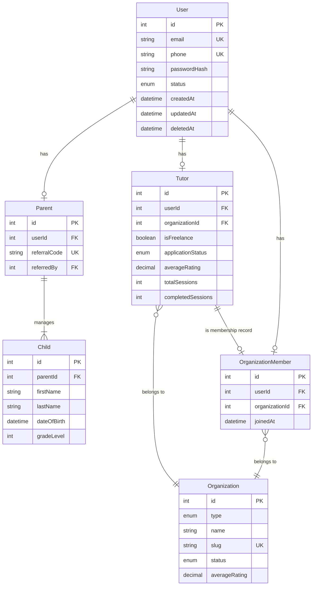
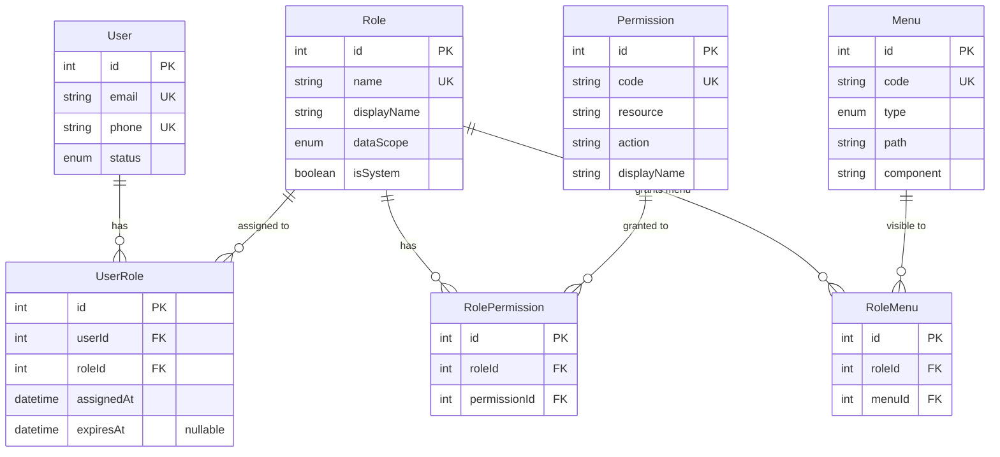
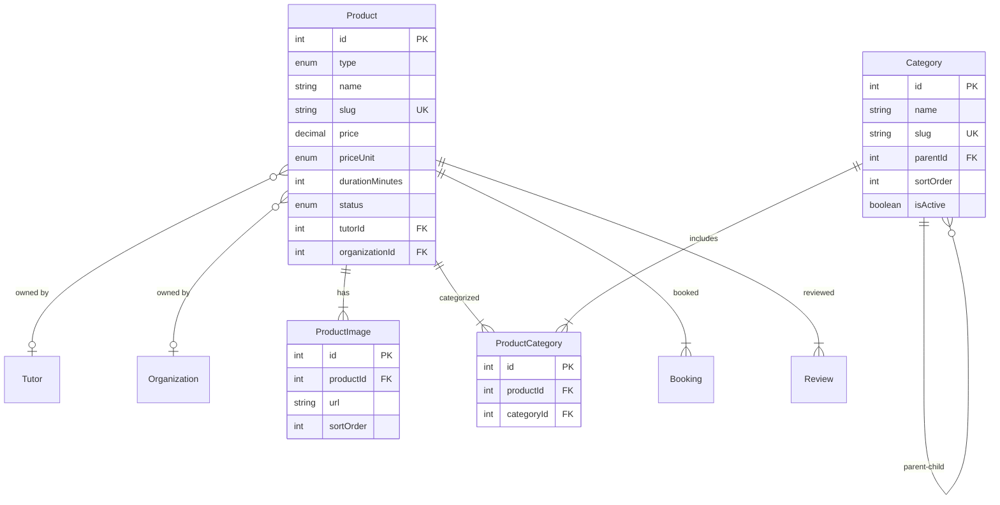
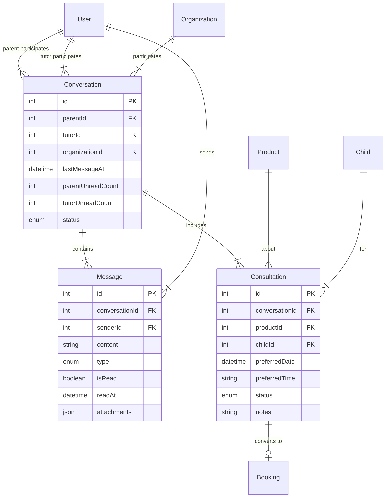
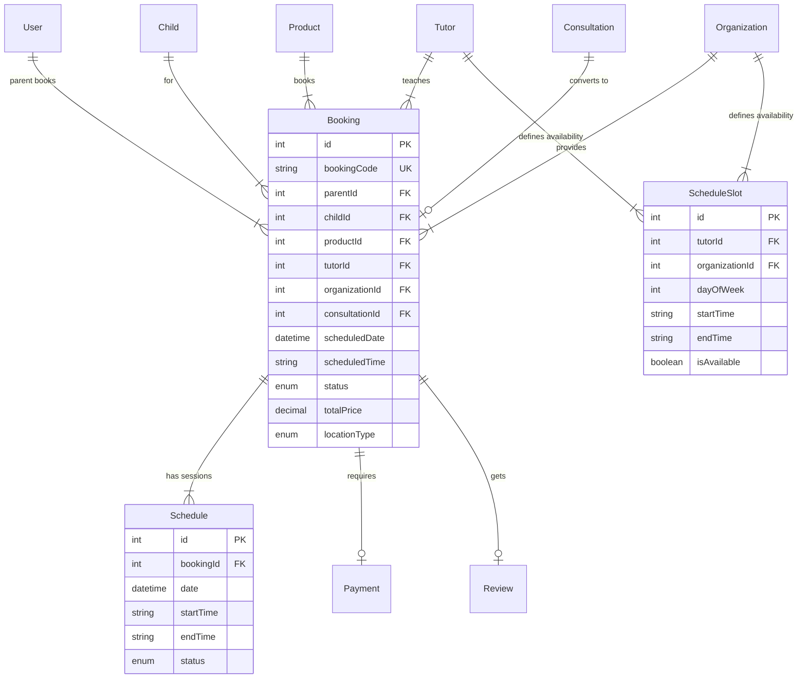
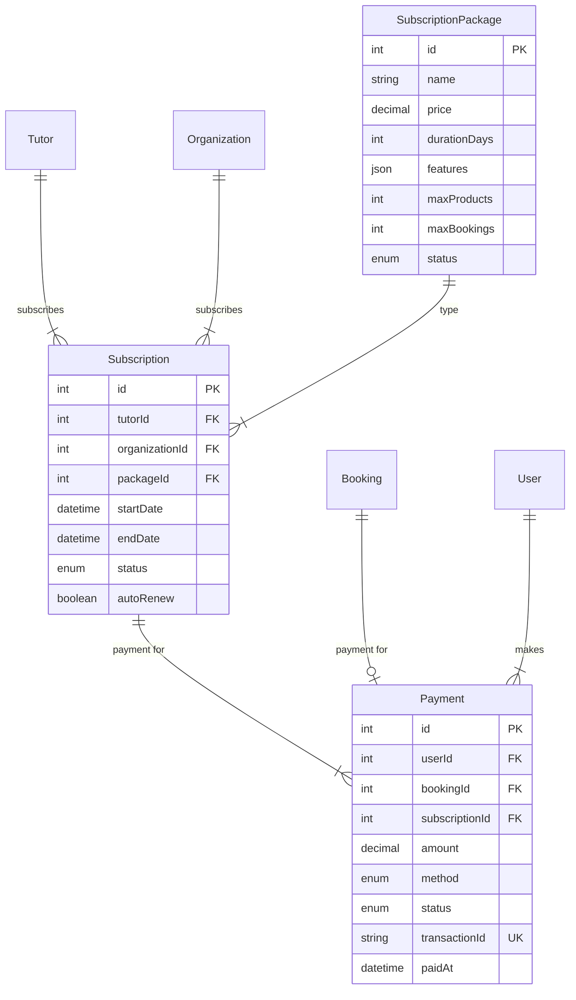
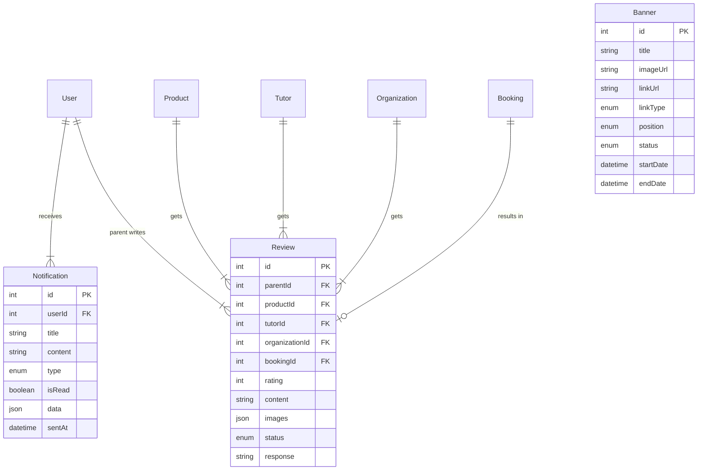
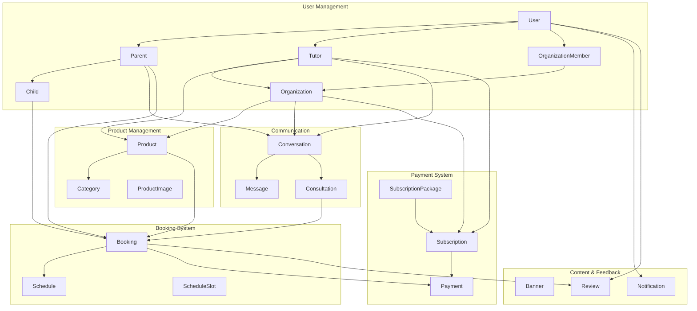

# KIGGLE Platform - Entity Relationship Diagram

## Overview

This document provides visual representations of the database schema for the KIGGLE Platform, including entity relationships, RBAC system, and module interactions.

---

## 1. USER & PROFILE MODELS



**Key Points:**
- User is the central table with 3 profile types: Parent, Tutor, OrganizationMember
- Parent manages multiple Children
- **Tutor always belongs to Organization** (INDIVIDUAL or COMPANY type)
- Organization membership is tracked via `OrganizationMember` (one organization per user)
- Authorization/permissions are handled by RBAC tables (see section 2)

---

## 2. RBAC (Role-Based Access Control) MODELS



**Key Features:**
- ✅ **Fine-grained permissions**: `product.create`, `booking.approve`, `report.export`
- ✅ **Data scopes per role** (`Role.dataScope`): GLOBAL / ORGANIZATION / USER
- ✅ **UserRole** is single source of truth for role assignments (no org field)
- ✅ **Menu integration**: Roles control API permissions + UI visibility
- ✅ **Cached**: Permissions/menu codes loaded once and cached in Redis

**Permission Naming**: `{resource}.{action}` (e.g., `product.create`, `booking.update`)

---

## 3. ACCESS CONTROL (HYBRID: RBAC + SCOPE)

### RBAC Component (What can user DO?)

```typescript
// Check action permissions
@RequirePermission('product.create')
async createProduct() { }

// UI visibility
<Button show={hasPermission('report.export')}>Export</Button>
```

### Scope Component (What DATA can user access?)

```typescript
// Initialized per request by DataScopeInterceptor
const ctx = await dataScopeContext.applyFilter();

// Example repository usage
return this.prisma.product.findMany({
  where: dataScopeContext.getOrganizationFilter(), // ORGANIZATION scope
});

return this.prisma.booking.findMany({
  where: dataScopeContext.getParentFilter(), // USER scope
});
```

**How it works:**
1. `UserContextService` loads roles, permissions, menu codes, organizationId
2. `Role.dataScope` determines GLOBAL / ORGANIZATION / USER
3. `DataScopeContext` stores aggregated data scope per request
4. Repositories/services use helper methods for consistent filtering

**Hybrid Benefits:**
- ✅ **RBAC**: Fine-grained UI permissions, button visibility, action control
- ✅ **Data scope**: Multi-tenant isolation via `DataScopeContext`
- ✅ **Performance**: Permissions & scopes cached, filters applied at DB layer
- ✅ **Security**: Double-layer protection (permission + data access)
- ✅ **Maintainable**: Add permissions or change scopes without code changes

---

## 4. PRODUCT & CATEGORY MODELS



**Key Points:**
- Product can belong to either Tutor or Organization
- Category supports hierarchical structure (parent-child)
- Product has multiple images and categories
- Many-to-many relationship between Product and Category

---

## 5. COMMUNICATION & CONSULTATION



**Key Points:**
- Conversation between Parent and Tutor/Organization
- Message tracking with read receipts
- Consultation is intermediate step before Booking
- Unread message counter for both sides

---

## 6. BOOKING & SCHEDULE SYSTEM



**Key Points:**
- Booking is main transaction between Parent and Tutor/Organization
- Each Booking can have multiple Schedule sessions (for courses)
- ScheduleSlot defines available time for Tutor/Organization
- Booking links to Consultation, Payment, and Review

---

## 7. PAYMENT & SUBSCRIPTION



**Key Points:**
- Payment serves two purposes: Booking payment and Subscription payment
- SubscriptionPackage defines features and limits
- Subscription for both Tutors and Organizations
- Auto-renewal support

---

## 8. CONTENT & REVIEW SYSTEM



**Key Points:**
- Banner for marketing and promotions
- Notification can be broadcast (userId = null) or targeted
- Review can be for Product, Tutor, or Organization
- Review moderation workflow with status

---

## 9. COMPLETE SYSTEM OVERVIEW



---

## Database Statistics

### Tables by Module

| Module | Tables | Description |
|--------|--------|-------------|
| User Management | 6 | User, Parent, Child, Tutor, Organization, OrganizationMember |
| RBAC System | 4 | Role, Permission, RolePermission, UserRole |
| Product Management | 4 | Product, Category, ProductCategory, ProductImage |
| Communication | 3 | Conversation, Message, Consultation |
| Booking & Schedule | 3 | Booking, Schedule, ScheduleSlot |
| Payment & Subscription | 3 | Payment, Subscription, SubscriptionPackage |
| Content & Review | 3 | Banner, Notification, Review |
| **Total** | **26** | |

**Note:** Hybrid model with full RBAC (fine-grained permissions) + Scope-based access control (data isolation).

### Enums Count

| Category | Count | Examples |
|----------|-------|----------|
| User-related | 6 | UserRole, UserStatus, Gender, TutorStatus, etc. |
| Product-related | 3 | ProductType, ProductStatus, PriceUnit |
| Communication | 3 | ConversationStatus, MessageType, ConsultationStatus |
| Booking-related | 3 | BookingStatus, ScheduleStatus, LocationType |
| Content-related | 5 | BannerStatus, NotificationType, ReviewStatus, etc. |
| Payment-related | 5 | PaymentMethod, PaymentStatus, SubscriptionStatus, etc. |
| **Total** | **25** | |

---

## Key Relationships

### 1-to-1 Relationships
- `User` ↔ `Parent`
- `User` ↔ `Tutor`
- `User` ↔ `OrganizationMember`
- `Booking` ↔ `Payment`
- `Booking` ↔ `Review`
- `Consultation` ↔ `Booking`

### 1-to-Many Relationships
- `Parent` → `Child`
- `Organization` → `OrganizationMember`
- `Product` → `ProductImage`
- `Conversation` → `Message`
- `Booking` → `Schedule`
- `User` → `UserRole`
- `Role` → `UserRole`

### Many-to-Many Relationships
- `Product` ↔ `Category` (through `ProductCategory`)
- `Role` ↔ `Permission` (through `RolePermission`)

### Optional Relationships (nullable FK)
- `Product` → `Tutor` OR `Organization` (owner)
- `Booking` → `Tutor` OR `Organization` (provider)
- `Conversation` → `Tutor` OR `Organization` (participant)

---

## Design Patterns

### 1. Polymorphic Associations
```
Product can belong to either:
- Tutor (tutorId)
- Organization (organizationId)

Booking can be provided by either:
- Tutor (tutorId)
- Organization (organizationId)

Payment can be for either:
- Booking (bookingId)
- Subscription (subscriptionId)
```

### 2. Single Table Inheritance (User)
```
User (base table)
├── Parent (extends User)
├── Tutor (extends User)
└── OrganizationMember (extends User)
```

### 3. Soft Delete Pattern
```
All main entities have deletedAt field:
- User
- Product
- Booking
- etc.
```

### 4. Audit Trail Pattern
```
All entities track:
- createdAt: When created
- updatedAt: When modified
- deletedAt: When soft deleted (nullable)
```

### 5. Status Machine Pattern
```
Entities with status workflows:
- TutorStatus: PENDING → UNDER_REVIEW → APPROVED/REJECTED
- BookingStatus: PENDING → CONFIRMED → IN_PROGRESS → COMPLETED
- PaymentStatus: PENDING → PROCESSING → COMPLETED/FAILED
```

### 6. RBAC Pattern
```
Role-Based Access Control:
- User → UserRole → Role → RolePermission → Permission
- Role.dataScope drives GLOBAL / ORGANIZATION / USER access
- Organization membership tracked separately via OrganizationMember
- Permissions + menu visibility cached in Redis
```

---

## Access Control Matrix (Simplified)

### System-Level (UserRole)

| Role | Scope | Data Access | Typical Actions |
|------|-------|-------------|-----------------|
| **KIGGLE_ADMIN** | GLOBAL | All data | Manage users, approve tutors/orgs, moderate content |
| **KIGGLE_STAFF** | GLOBAL | All data (read-only) | View reports, moderate reviews |
| **PARTNER_ADMIN** | ORGANIZATION | Own org data | Manage products, bookings, members, view reports |
| **PARTNER_STAFF** | ORGANIZATION | Own org data | Limited by permission flags |
| **TUTOR** | ORGANIZATION | Own org data | Manage own products, view assigned bookings |
| **PARENT** | USER | Public + own data | Book services, manage children, write reviews |

### Organization-Level (OrganizationMemberRole + Flags)

| Role | canManageProducts | canManageBookings | canManageMembers | canViewReports | Description |
|------|-------------------|-------------------|------------------|----------------|-------------|
| **ADMIN** | ✅ Yes | ✅ Yes | ✅ Yes | ✅ Yes | Full access to organization |
| **STAFF (typical)** | ✅ Yes | ✅ Yes | ❌ No | ❌ No | Can manage products/bookings |
| **STAFF (limited)** | ❌ No | ✅ Yes | ❌ No | ❌ No | Can only manage bookings |
| **STAFF (viewer)** | ❌ No | ❌ No | ❌ No | ✅ Yes | Read-only + reports |

**Note:** Permission flags are checked ONLY for STAFF role. ADMIN always has all permissions.

---

## Scaling Considerations

### Horizontal Partitioning (Sharding)
```
Potential sharding keys:
- User data: by userId or geographic region
- Booking data: by organizationId or date range
- Message data: by conversationId
- Analytics: by date (time-series data)
```

### Vertical Partitioning
```
Separate databases for:
1. Core Data (users, products, bookings)
2. Communication (conversations, messages)
3. Analytics & Logs
4. File Storage metadata
```

### Read Replicas
```
Master-Slave replication for:
- Product listings (read-heavy)
- Search queries
- Analytics dashboards
- Reporting
- Permission checks (cache frequently used)
```

### Caching Strategy
```
Redis cache for:
- User context (key: user:{userId}:context) - organizationId, permissions
- Product listings
- Category trees
- Conversation lists
- Unread counts
- Dashboard statistics
```

---

## Index Strategy

### Critical Indexes

**User Management:**
```sql
CREATE INDEX idx_users_email ON users(email);
CREATE INDEX idx_users_phone ON users(phone);
CREATE INDEX idx_users_status ON users(status);
```

**Organization Members:**
```sql
CREATE INDEX idx_organization_members_user ON organization_members(user_id);
CREATE INDEX idx_organization_members_org ON organization_members(organization_id);
```

**Products:**
```sql
CREATE INDEX idx_products_slug ON products(slug);
CREATE INDEX idx_products_status ON products(status) WHERE deleted_at IS NULL;
CREATE INDEX idx_products_featured ON products(is_featured, sort_order) WHERE status = 'ACTIVE';
```

**Bookings:**
```sql
CREATE INDEX idx_bookings_code ON bookings(booking_code);
CREATE INDEX idx_bookings_date_status ON bookings(scheduled_date, status);
CREATE INDEX idx_bookings_parent ON bookings(parent_id, status);
CREATE INDEX idx_bookings_tutor ON bookings(tutor_id, scheduled_date);
```

**Messages:**
```sql
CREATE INDEX idx_messages_conversation_created ON messages(conversation_id, created_at DESC);
CREATE INDEX idx_messages_unread ON messages(conversation_id, is_read) WHERE is_read = false;
```

---

## Related Documentation

- [Database Design](./DATABASE_DESIGN.md) - Detailed schema documentation

---

**Last Updated**: 2025-11-25  
**Version**: 2.0  
**Author**: Backend Team
