# Scope-Based Access Control - Architecture Diagrams

> Visual representation of the Scope-Based Access Control system

---

## 1. System Architecture Overview

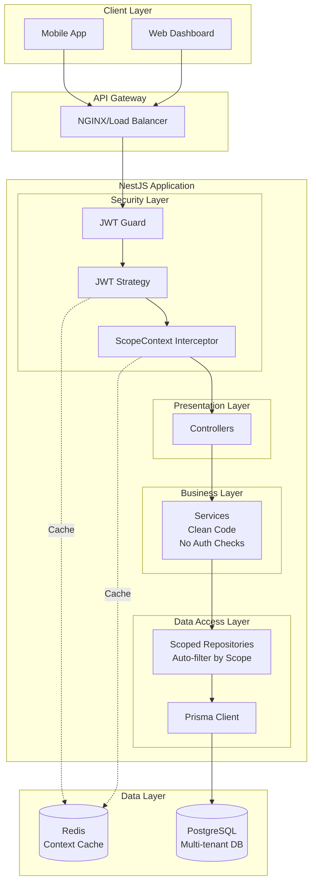

---

## 2. Request Flow Diagram

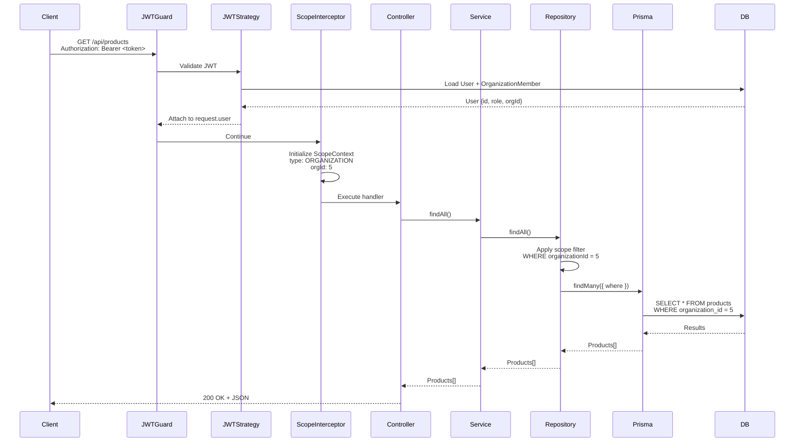

---

## 3. Scope Resolution Flow

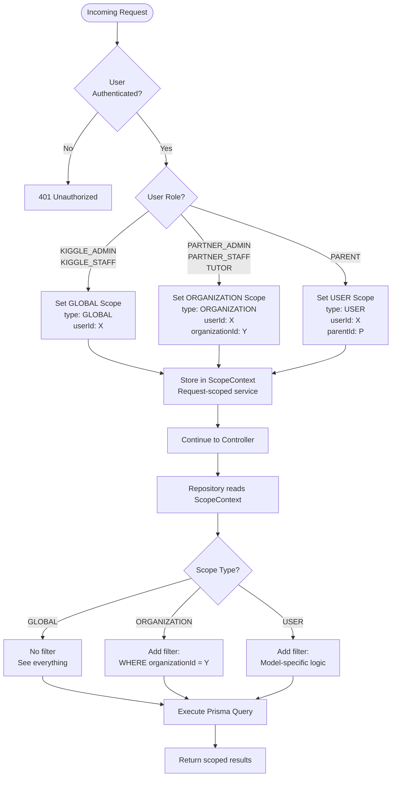

---

## 4. Database Schema - Multi-Tenant Model

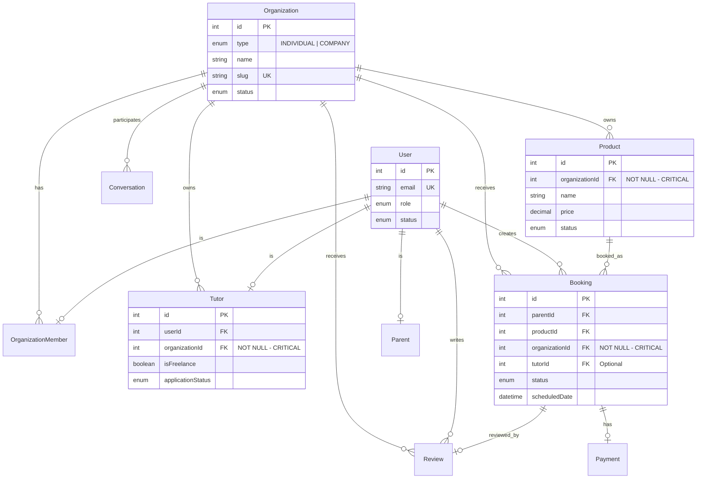

---

## 5. Scope Application Matrix

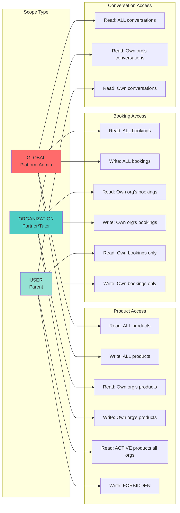

---

## 6. Repository Pattern Structure

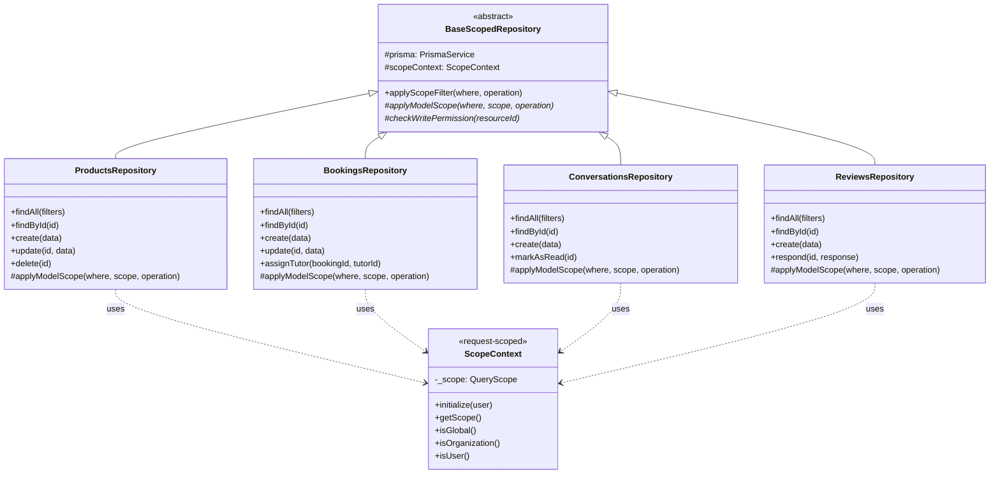

---

## 7. Multi-Tenant Organization Model

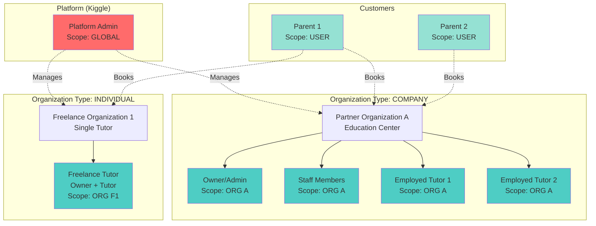

---

## 8. Performance Optimization Strategy

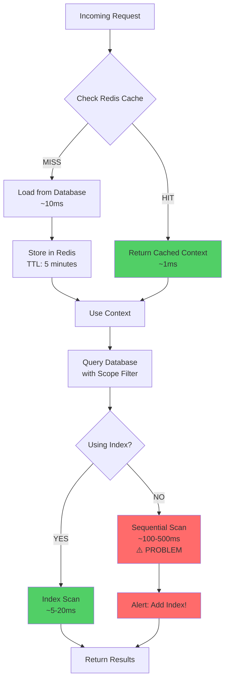

---

## 9. Security Layers

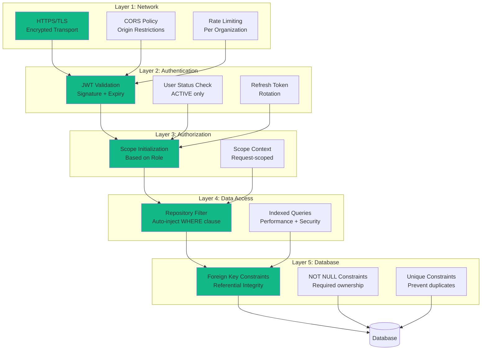

---

## 10. Deployment Architecture

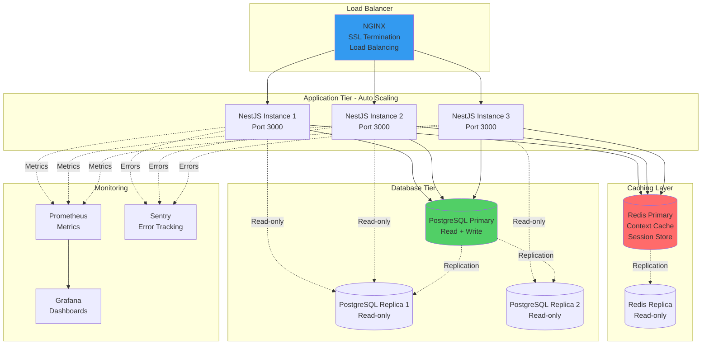

---

## 11. Code Organization

```
src/
├── 🔐 common/                           # Shared utilities
│   ├── services/
│   │   ├── scope-context.service.ts     # ⭐ Core: Request-scoped context
│   │   └── user-context.service.ts      # User data caching
│   ├── repositories/
│   │   └── base-scoped.repository.ts    # ⭐ Core: Base repository
│   ├── interceptors/
│   │   └── scope-context.interceptor.ts # ⭐ Initialize scope
│   └── guards/
│       └── jwt-auth.guard.ts            # JWT validation
│
├── 📦 modules/                          # Feature modules
│   ├── products/
│   │   ├── repositories/
│   │   │   └── products.repository.ts   # Extends BaseScopedRepository
│   │   ├── products.service.ts          # ✅ Clean business logic
│   │   └── products.controller.ts       # HTTP handlers
│   │
│   ├── bookings/
│   │   ├── repositories/
│   │   │   └── bookings.repository.ts
│   │   ├── bookings.service.ts
│   │   └── bookings.controller.ts
│   │
│   └── auth/
│       ├── strategies/
│       │   └── jwt.strategy.ts          # Load user + org context
│       └── auth.service.ts
│
└── 🏗️ infrastructure/                   # External services
    ├── db/
    │   ├── prisma.service.ts
    │   └── prisma-scoped.extension.ts   # Optional: Prisma middleware
    └── cache/
        └── redis.service.ts             # Context caching

Legend:
⭐ = Core scope-based access control components
✅ = Benefits from automatic scope filtering
🔐 = Security layer
📦 = Business logic layer
🏗️ = Infrastructure layer
```

---

## 12. Migration Timeline

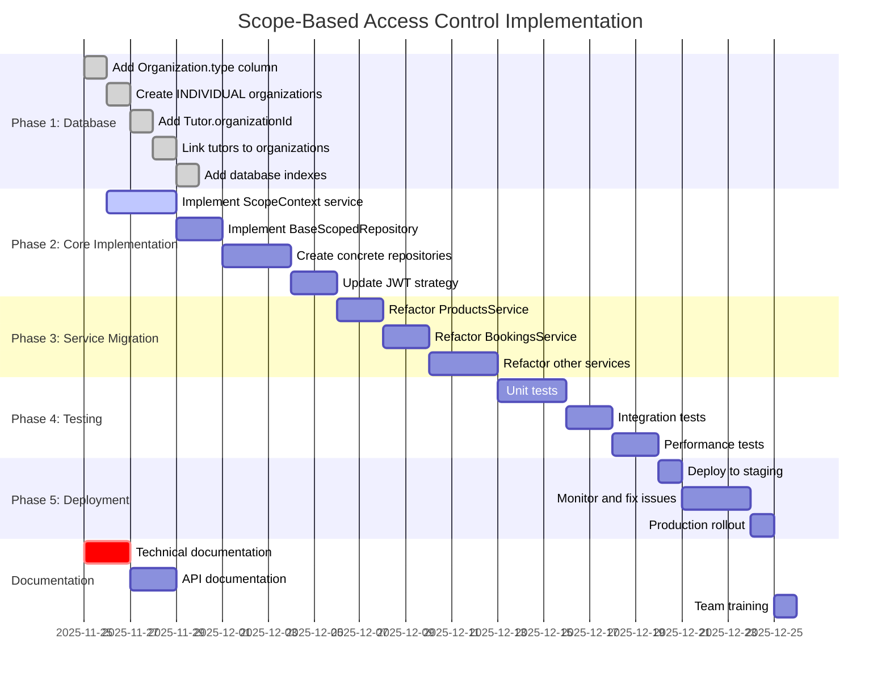

---

**End of Diagrams Document**

